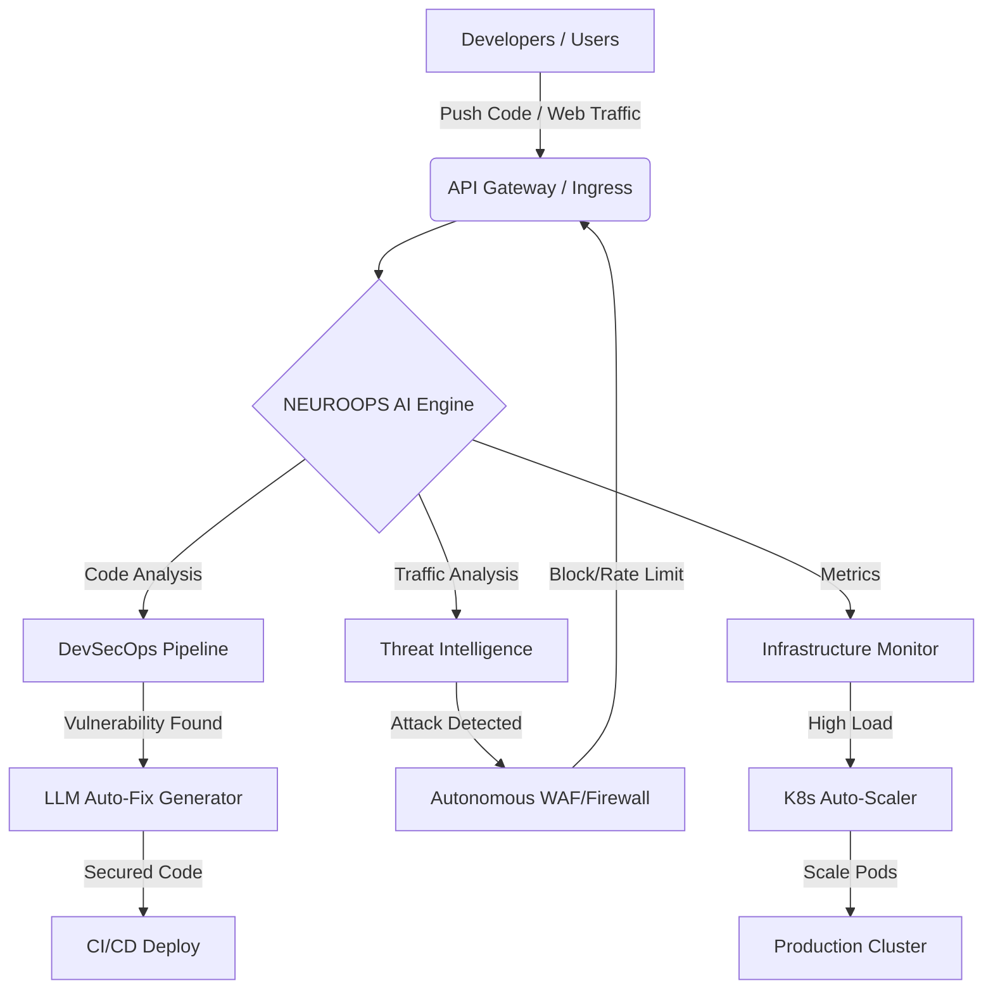

  
# 🧠 NEUROOPS AI
**Autonomous IT with Cyber Defense Intelligence**

*A next-generation DevSecOps and Infrastructure Management platform that doesn't just alert you to problems—it fixes them autonomously.*

> "A security-first autonomous IT system that protects, predicts, and self-manages infrastructure — with AI as its core brain."

---

## 🛡️ Core Vision (70% Security, 30% IT Ops)
NEUROOPS AI bridges the gap between development and runtime. It ensures that code is secure before deployment and that the infrastructure can defend itself against live threats without human intervention.

## 💡 The Problem: Alert Fatigue & Response Latency
In modern cloud environments, security teams are drowning in alerts. The time between a vulnerability being introduced, detected, and remediated (Mean Time to Remediate - MTTR) is often measured in days or weeks. During a live cyberattack, human response times are simply too slow to prevent data exfiltration or system downtime.

## 🚀 The Solution: NEUROOPS AI
NEUROOPS AI is an autonomous, AI-driven operations center. It acts as a virtual Site Reliability Engineer (SRE) and Security Analyst that works 24/7. It monitors infrastructure, detects anomalies, intercepts vulnerable code in the CI/CD pipeline, and **autonomously applies fixes** before threats can be exploited.

---

## ✨ Key Features

### 🛡️ 1. Autonomous DevSecOps Pipeline
- **Real-time SAST/DAST Scanning:** Analyzes code commits instantly.
- **Vulnerability Detection:** Identifies critical flaws like SQL Injections and Hardcoded Secrets.
- **AI Auto-Fix:** Automatically rewrites vulnerable code and deploys the secured version without human intervention.

### 🌍 2. Global Threat Intelligence
- **Live Threat Map:** Visualizes incoming attacks (DDoS, Brute Force, Malware) across global server nodes.
- **Predictive Defense:** Uses AI to predict attack vectors and proactively scale defenses.
- **Runtime Threat Detection**: Uses machine learning to identify anomalous traffic patterns.

### 🤖 3. Explainable AI Decisions
- **Audit Trail:** Every autonomous action is logged with an AI Confidence Score.
- **Human-in-the-Loop:** Configurable confidence thresholds.
- **Explainable AI (XAI)**: A transparent dashboard that explains *why* the AI took specific actions.

### 📊 4. Real-time Telemetry & Analytics
- **Live Event Stream:** A terminal-like interface showing real-time system logs.
- **Dynamic Metrics:** Live graphs tracking CPU utilization, network traffic, and active threat mitigation.

### ⚙️ 5. Self-Healing Infrastructure
- **Predictive Auto-scaling:** Scales resources *before* traffic spikes hit based on historical AI models.
- **Node Isolation:** Automatically quarantines compromised server nodes to prevent lateral movement.
- **Auto-Restarts**: Predictive AIOps that restarts crashed services and scales resources to maintain SLA performance.

---

## 🎬 Demos

### 🎬 Demo 1: The DevSecOps Gate
1. Go to **Security Lab** tab.
2. Click **Trigger Secure Deployment Scan**.
3. Watch the AI block an insecure push (SQL Injection/Secrets).

### 🎬 Demo 2: Real-time DDoS Defense
1. Trigger a **L7 DDoS Attack** from the dashboard or run `python simulations/ddos_demo.py`.
2. Watch the **Network Traffic** spike in red.
3. Observe the **Autonomous Action Engine** block the suspicious IPs and mitigate the threat within seconds.

### 🎬 Demo 3: Self-Healing IT
1. Go to **IT Ops** tab.
2. Click **Kill Database Process**.
3. Watch the system detect the node failure and restart it automatically to restore the SLA.

---

## 🔄 System Workflow

1. **Code Commit / Traffic Ingress:** A developer pushes code, or external traffic hits the load balancer.
2. **AI Interception:** NEUROOPS AI intercepts the event.
3. **Analysis Engine:** 
   - *For Code:* Parses AST, checks against OWASP Top 10, and flags vulnerabilities.
   - *For Traffic:* Analyzes packet heuristics and rate limits.
4. **Decision Matrix:** The AI calculates a confidence score for a remediation action.
5. **Autonomous Action:**
   - If Confidence > Threshold (e.g., 90%): AI applies the fix (rewrites code or blocks IP) and deploys.
   - If Confidence < Threshold: AI alerts the human operator with a recommended fix.
6. **Telemetry Update:** The dashboard updates in real-time, reflecting the mitigated threat and stabilized infrastructure.

---

## 🏗️ System Architecture (Conceptual)

---

## 💻 Tech Stack

- **Frontend Framework:** React 18 (Vite)
- **Styling:** Tailwind CSS (Custom glassmorphism and neon-glow design system)
- **Animations:** Framer Motion (Complex pipeline orchestrations and layout transitions)
- **Data Visualization:** Recharts (Responsive, real-time area charts)
- **Icons:** Lucide React
- **Typography:** Inter & JetBrains Mono

---

  
Built with 💻 and ☕ for the Hackathon.

